# TikTok-Shop-Crossborder
TikTok Shop 跨境商城后台全套解决方案 (AI-Powered)
#  本项目是一套专为中国出海老板设计的成熟、可商用跨境电商系统。它不仅解决了“能不能用”的问题，更通过 AI 深度集成解决了“好不好用”和“运营成本”的问题。
# [👉 立即联系获取完整演示版: @daqi56] （注：本仓库仅展示核心架构与 API 协议，完整商业源码请咨询获取)
# 抖音商城 · 多语言任务与钱包系统 | ThinkPHP + UniApp 全栈项目
[](https://www.php.net/)
[](https://www.thinkphp.cn/)
[](https://vuejs.org/)
[](https://uniapp.dcloud.io/)
[](https://www.mysql.com/)

> **多语言电商任务与会员钱包系统**：用户注册邀请、VIP 等级、订单任务、余额提现、充值记录、站内消息、幸运抽奖，前后端分离，支持 H5 / 多端。  
> 本仓库为 **后端 ThinkPHP 6 + 前端 UniApp (Vue)** 完整实现，适合二次开发、学习全栈与 SEO 友好部署。

---

## 📑 目录 | Table of Contents

- [项目简介](#-项目简介--about)
- [核心功能](#-核心功能--features)
- [技术架构](#-技术架构--tech-stack)
- [系统架构图](#-系统架构图)
- [目录结构](#-目录结构)
- [环境要求](#-环境要求)
- [快速开始](#-快速开始)
- [配置说明](#-配置说明)
- [API 文档](#-api-文档)
- [定时任务](#-定时任务)
- [多语言支持](#-多语言支持)
- [截图与展示](#-截图与展示)
- [常见问题](#-常见问题)
- [许可证](#-许可证)

---

## 📖 项目简介 | About

**抖音商城系统** 是一套完整的 **多语言任务与会员钱包 Web 应用**，包含：

- **用户端**：注册/登录（邀请码）、VIP 等级购买、订单任务流程、余额与提现、充值记录、站内消息、公告、幸运大转盘抽奖等。
- **后台管理**：用户与订单管理、财务管理、产品与公告、系统配置等（基于 ThinkPHP 多应用 + 后台模板）。
- **多语言**：界面与错误提示支持 **中文、英语、葡萄牙语、荷兰语、希伯来语、法语、西班牙语、德语、阿拉伯语**，便于国际化与搜索引擎收录。

本项目采用 **前后端分离**：后端提供 RESTful API，前端使用 **UniApp** 可编译为 **H5、微信小程序、App** 等多端，便于搜索引擎抓取 H5 版本并做 SEO 优化。

---

## ✨ 核心功能 | Features

| 模块 | 功能说明 |
|------|----------|
| **用户与认证** | 用户名密码登录、邀请码注册、交易密码、退出登录、登录态缓存 |
| **VIP 会员** | 多等级 VIP、按等级定价、购买/升级、提现比例与订单比例配置 |
| **订单任务** | 生成订单、提交订单、订单列表与详情、佣金与多级返佣、连单/热销活动 |
| **钱包与资金** | 余额、钱包流水、提现申请（含手续费与时段限制）、充值记录、每日提现次数限制 |
| **银行卡/收款** | 绑定与修改银行卡、Wise/Revolut/USDT 等，可配置是否允许修改 |
| **消息与公告** | 站内消息、已读未读、公告列表、多语言协议与帮助文案 |
| **抽奖** | 幸运大转盘、奖品配置与权重、中奖记录、抽奖次数 |
| **首页与配置** | 运营时间、活动图、证书图、弹窗、客服链接、多语言首页文案 |

---

## 🛠 技术架构 | Tech Stack

| 层级 | 技术 | 说明 |
|------|------|------|
| **后端** | PHP ≥ 7.2.5 | 运行环境 |
| | ThinkPHP 6 | 框架、多应用（api + admin）、路由、中间件 |
| | Think ORM | 模型、事务、锁 |
| | MySQL 5.7+ | 主库，表前缀可配置（如 `mod_`） |
| **前端** | Vue 2 | 基础框架 |
| | UniApp | 多端统一（H5 / 小程序 / App） |
| | uView UI / Vant | 组件库 |
| | vue-i18n | 多语言 |
| **扩展** | BCMath、CURL、JSON | PHP 扩展；可选 Memcache、ImageMagick |

下图概括前后端与数据流关系：

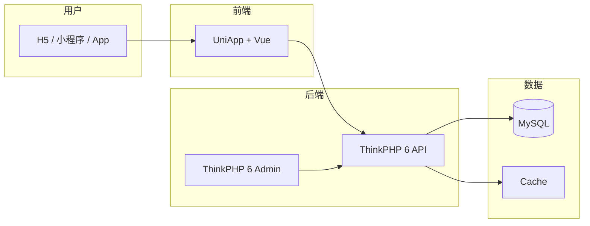

---

## 🏗 系统架构图

**请求链路概览**（从浏览器到数据库）：

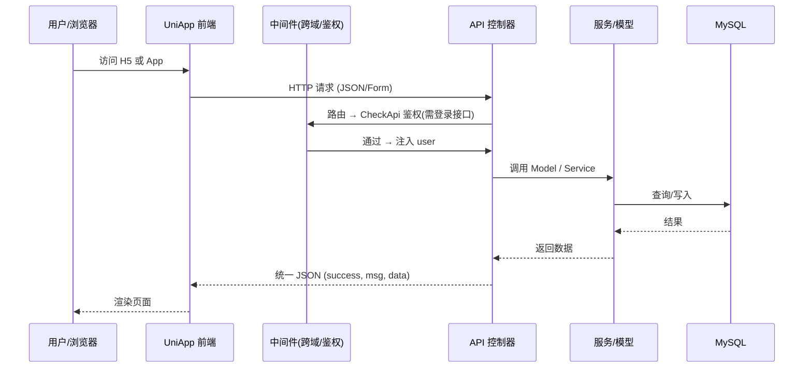

**数据库表关系概览**（核心表）：

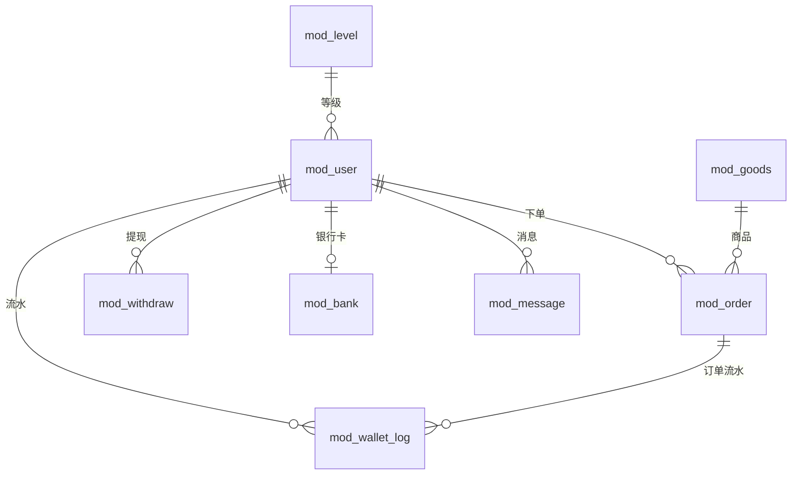

---

## 📁 目录结构

```
ayang-jiudianshua/
├── backend/                 # 后端 ThinkPHP 6
│   ├── app/
│   │   ├── api/             # API 应用
│   │   │   ├── controller/  # Index, Account, Trade, Jiang
│   │   │   └── route/
│   │   ├── admin/           # 后台管理（控制器+视图）
│   │   ├── common/          # 公共模型、服务、中间件
│   │   │   ├── model/       # User, Order, Goods, Level, Bank, Withdraw...
│   │   │   └── service/
│   │   └── middleware/
│   ├── config/
│   ├── public/              # 入口、静态资源、上传目录
│   ├── docs/                # API 扫描列表、OpenAPI JSON
│   └── composer.json
├── frontend/                # 前端 UniApp
│   ├── pages/               # 页面（登录、首页、订单、个人中心、抽奖等）
│   ├── components/         # 公共组件（转盘等）
│   ├── static/              # 图片、多语言资源
│   ├── store/               # 状态
│   ├── uview-ui/
│   └── package.json
├── mysql/                   # 数据库备份/结构（可选）
├── docs/                    # 项目级文档（本 README 等）
└── README.md
```

---

## ⚙️ 环境要求

| 环境 | 版本要求 |
|------|----------|
| PHP | ≥ 7.2.5，推荐 7.3/7.4 |
| MySQL | 5.7+ |
| Node.js | 用于前端构建（UniApp） |
| 扩展 | BCMath、CURL、JSON；生产建议 Fileinfo、Memcache、ImageMagick |

---

## 🚀 快速开始

### 1. 克隆与后端安装

```bash
# 进入后端目录
cd backend

# 安装 PHP 依赖
composer install

# 复制环境配置并修改数据库等
cp .env.example .env
# 编辑 .env：database.hostname、database.database、database.username、database.password、database.prefix
```

### 2. 数据库

- 创建数据库，字符集 `utf8mb4`。
- 若使用项目提供的 SQL：导入 `mysql/` 下备份或执行迁移（如有）。
- 确认 `config/database.php` 或 `.env` 中表前缀与现有表一致（如 `mod_`）。

### 3. Web 入口

- 将站点根目录指向 `backend/public`，或配置 Nginx/Apache 使 `index.php` 处理请求。
- API 路由定义在 `app/api/route/api.php`，默认路径形式：`/api/方法名`（如 `/api/login`），以实际多应用配置为准。

### 4. 前端

```bash
cd frontend
npm install
# H5 开发
npm run dev:h5
# 或 构建 H5
npm run build:h5
```

将前端请求的 API 基础地址配置为你的后端域名（如 `https://your-api.com`）。

---

## 🔧 配置说明

| 配置项 | 位置 | 说明 |
|--------|------|------|
| 数据库 | `.env` / `config/database.php` | hostname、database、username、password、prefix |
| 系统基础 | 后台 → 系统配置 | 运营时间、提现时间、注册奖励、分佣比例等 |
| 系统首页 | 后台 → 首页配置 | 公告、帮助、关于我们、活动图、多语言文案 |
| 银行/收款 | 后台 → 银行类型 | 提款方式与展示名称 |
| 客服链接 | 后台 → 链接配置 | 客服跳转链接 |
| 用户相关 | `config/user.php` | 如注册邮箱是否必填、是否允许修改绑定银行卡等 |

---

## 📡 API 文档

- **接口扫描列表**（方法名、入参、涉及表）：[backend/docs/API_SCAN_LIST.md](backend/docs/API_SCAN_LIST.md)
- **OpenAPI 3.0 规范**（含大白话描述，适合 AI 工具集）：[backend/docs/openapi-tools.json](backend/docs/openapi-tools.json)

需登录的接口请在请求头中携带 `authorization: <登录返回的 token>`。

---

## ⏰ 定时任务

每日定时重置订单等逻辑可通过系统 cron 调用：

```bash
# 示例：每天执行
cd /www/wwwroot/your-project/backend && php cron_reset_orders.php
```

请根据实际路径与业务调整执行时间与脚本内容。

---

## 🌍 多语言支持

- **前端**：`frontend/locale/` 下按语言码（zh、en、pt、nl、he、fr、es、de、ar）维护文案。
- **后端**：接口错误提示根据请求参数 `lang` / `langs` 返回对应语言文案，便于 SEO 与多地区用户。

---

## 📸 截图与展示


| 模块 | 说明 | 图片演示| 
| :--- | :--- | :--- |
| **登录/注册** | 抖音商城多语言登录与邀请码注册 | 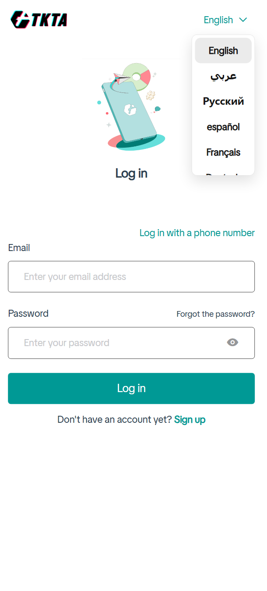 |
| **首页** | 抖音商城多语言首页、活动与公告 | 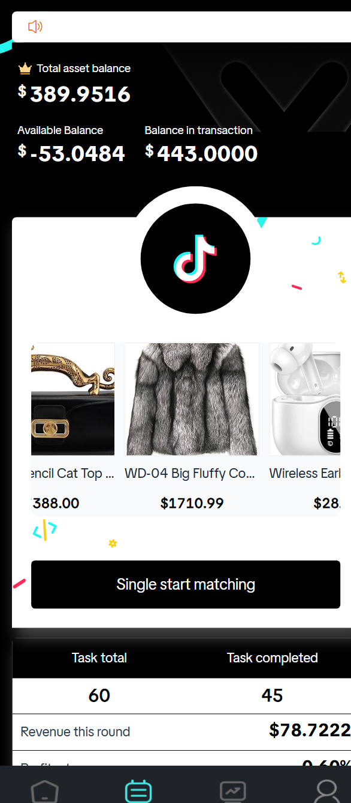 |
| **订单任务** | 抖音商城订单列表与提交任务 | 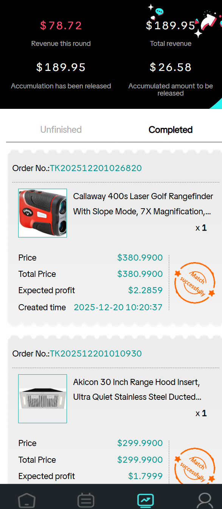 |
| **个人中心** | 抖音商城余额、VIP | 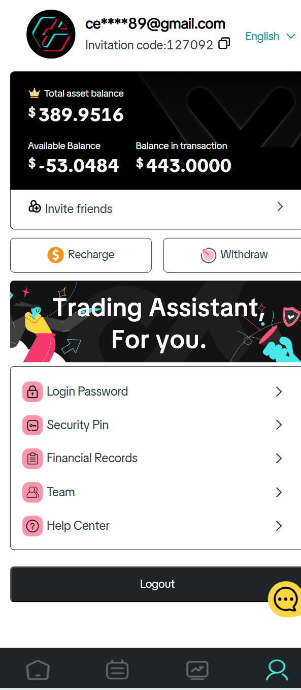 |
| **幸运抽奖** | 抖音商城首页 | 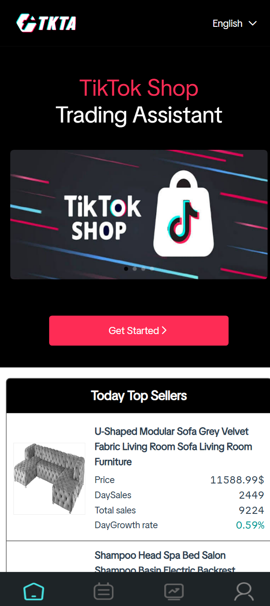 |


---
## 后台截图展示

| 模块 | 说明 | 图片演示| 
| :--- | :--- | :--- |
| **总后台管理页面** | 总后台管理 |  |
| **代理后台管理页面** | 代理后台管理 | 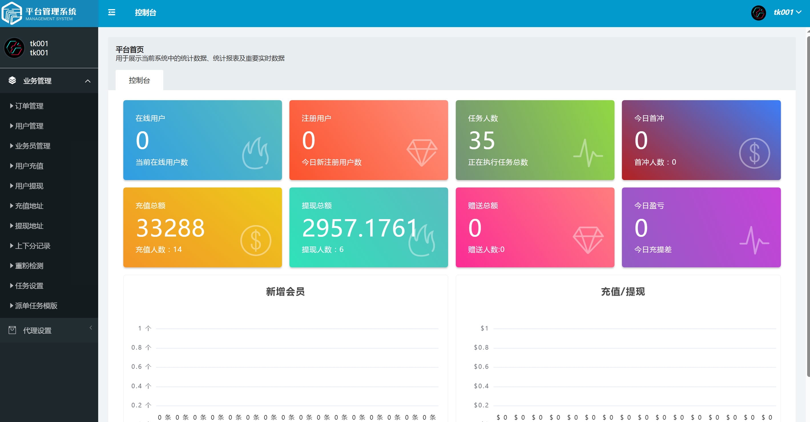 |
| **业务员后台管理页面** | 业务员后台管理 |  |
| **用户管理功能** | 用户管理 | 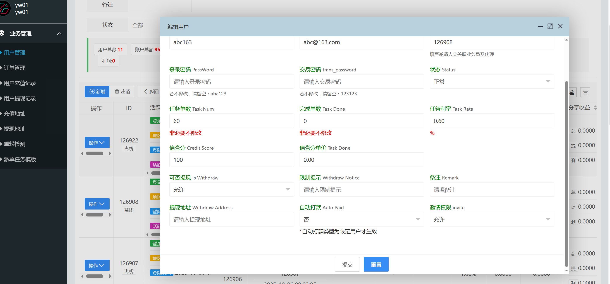 |
| **部分设置功能展示** | 插针演示 | 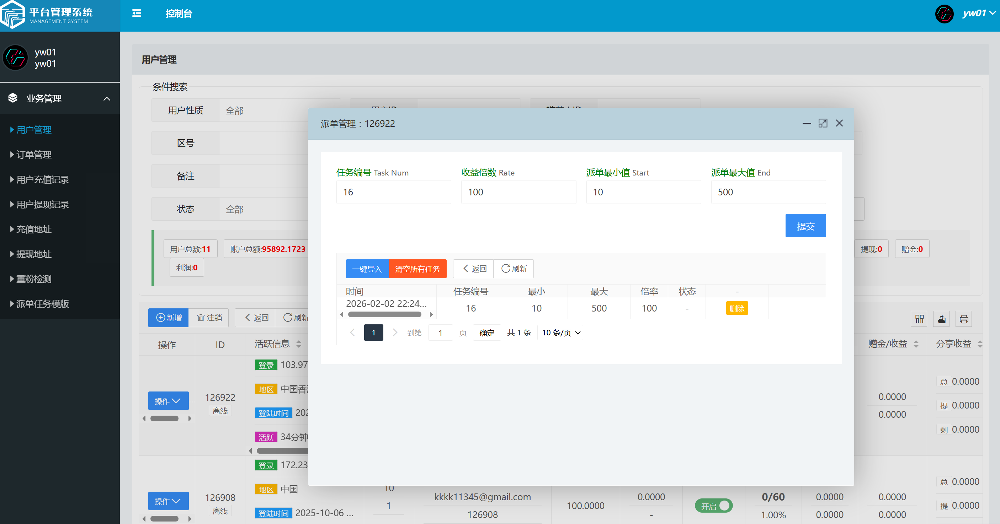 |

📈 获客与咨询 (Contact for Business)
如果您需要完整的商业版源码、数据库结构以及 AI 自动化部署方案，请联系：

Telegram: 👉 点击联系技术负责人 (@daqi56)

业务范围：承接各类交易所、跨境商城、TikTok 自动化工具深度定制。
## ❓ 常见问题

**Q：登录后 401 或提示未登录？**  
A：检查请求头是否携带 `authorization`，且值为登录接口返回的 token。

**Q：提现/下单报“余额不足”但界面显示有余额？**  
A：可能存在待支付订单占用余额，接口会按「可用余额 = 余额 - 待支付订单金额」计算。

**Q：如何关闭或修改“每日仅可提现一次”？**  
A：在 `Account::setWithData` 中查找每日提现次数校验逻辑，按业务修改或注释。

**Q：前端请求跨域？**  
A：后端已使用跨域中间件（如 `AllowCros`），确保 Nginx 未重复拦截 OPTIONS 或覆盖 CORS 头。

---

## 📄 许可证

本项目后端基于 ThinkPHP（Apache-2.0）。使用与二次开发请遵守各依赖组件的许可证及当地法律法规。

---

---

